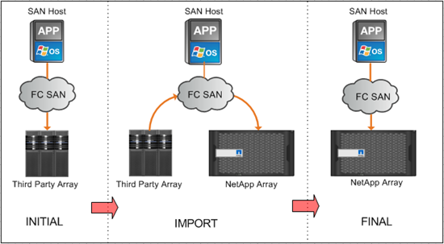

= Panoramica sull'importazione di LUN esterni
:allow-uri-read: 
:icons: font
:imagesdir: ../media/

[role="lead"]
L'importazione di LUN esterne (FLI) è una funzionalità integrata in ONTAP che consente agli utenti di importare i dati da LUN di array esterni a LUN NetApp in modo semplice ed efficiente.

Tutte le migrazioni FLI operano a livello di LUN. FLI è uno strumento strettamente basato su blocchi; le migrazioni basate su file, record, NFS e CIFS non sono supportate. Per una discussione su altre metodologie di migrazione per i protocolli a livello di file, come NFS e CIFS/SMB, consultare https://library.netapp.com/ecm/ecm_get_file/ECMP12363719["Guida di riferimento rapido agli strumenti per la migrazione dei dati"].

FLI sfrutta la tecnologia NetApp FlexArray® per rilevare i LUN degli array RAID esterni e estrarre i dati da essi. FlexArray consente a un controller NetApp ONTAP di agire come iniziatore davanti a uno o più array di terze parti. FlexArray può montare LUN da questi array come storage back-end e quindi presentare lo spazio di tali LUN come storage unificato NetApp (consentendo l'accesso ai protocolli FCP, FCoE, iSCSI, NFS e CIFS/SMB) agli host nel tuo ambiente SAN o NAS.

FLI non richiede una licenza FlexArray. FLI sfrutta la tecnologia FlexArray per copiare il LUN esterno in un array ONTAP NetApp e consentire agli host e alle applicazioni che utilizzano tale LUN di puntare all'array NetApp che ospita il LUN in questione. Anche se ONTAP non richiede più una migrazione professionale, si consiglia vivamente di coinvolgere i servizi professionali nell'ambito, nella pianificazione e nella formazione per tutte le migrazioni, tranne quelle più semplici.

FLI è stato sviluppato per migrare LE LUN SAN a ONTAP. FLI supporta una serie di requisiti di migrazione, tra cui, a titolo esemplificativo ma non esaustivo, i seguenti:

* Migrazione dei dati tra array storage eterogenei da EMC, Hitachi, HP e altri vendor a NetApp, come supportato dalla configurazione FlexArray.
* Semplificazione e accelerazione delle migrazioni dei dati a blocchi durante il trasferimento, il consolidamento e la sostituzione degli array del data center.
* Consolidamento di migrazioni e riallineamenti LUN in un singolo workflow.

Inoltre, la procedura di transizione da 7-Mode a ONTAP è in grado di convertire da aggregati a 32 bit a 64 bit, risolvere problemi di allineamento e migrare LE LUN come singola operazione.

FLI consente allo storage NetApp di rilevare le LUN da importare per la migrazione dei dati. Le LUN esterne vengono visualizzate come dischi sullo storage NetApp e non hanno alcuna proprietà assegnata automaticamente in modo che i dati dell'utente non vengano sovrascritti per errore. I dischi che contengono LUN di array esterni devono essere contrassegnati come estranei. Per utilizzare FLI per lo storage NetApp, è necessario rispettare rigorosamente le regole per la configurazione dei LUN degli array esterni. Vedere l'argomento, xref:concept_lun_requirements_and_limitations.adoc[Requisiti e limitazioni del LUN].

FLI richiede almeno una porta FC fisica su ciascun controller e la migrazione diretta delle LUN in modalità Initiator. Sono preferibili due porte, una per ciascun fabric, ma è possibile utilizzarne anche una singola. Queste porte vengono utilizzate per connettersi all'array sorgente e devono essere suddivise in zone e mascherate per poter visualizzare e montare le LUN sorgente. Se è necessario modificare una porta da target a initiator, consultare link:https://docs.netapp.com/us-en/ontap/san-admin/configure-fc-adapters-task.html["Configurare gli adattatori FC"^] .

Le migrazioni FLI possono essere eseguite offline, che interrompe le operazioni per tutta la durata dell'importazione, o online, il che è principalmente senza interruzioni.

Questa figura mostra una migrazione dei dati offline FLI, in cui l'host viene portato offline per la migrazione. L'array NetApp copia i dati direttamente dall'array di terze parti.

image::../media/foreign_lun_import_overview_1.png[Panoramica sulla migrazione dei dati FLI]

Questa figura mostra una migrazione dei dati online FLI. L'host è connesso al controller NetApp in cui è ospitata la nuova LUN. L'operazione host può quindi riprendere e continuare durante l'importazione.

