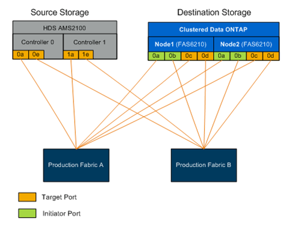

= Requisiti di cablaggio fisico per FLI
:allow-uri-read: 
:icons: font
:imagesdir: ../media/

[role="lead"]
FLI ha gli stessi requisiti di cablaggio di NetApp FlexArray. Le porte NetApp storage initiator sono collegate al fabric a cui sono collegate le porte di destinazione dello storage di origine. Segui le Best practice di FlexArray durante la connessione dello storage di origine allo storage NetApp.

Gli array di storage utilizzati durante la migrazione devono avere un percorso primario da ciascun controller (in uso) presente in entrambi i fabric. Ciò significa che l'array di origine e i nodi dell'array di destinazione su cui viene eseguita la migrazione devono trovarsi in una zona comune su entrambi i fabric. Non è necessario aggiungere altri controller nel cluster NetApp, ma solo quelli che effettivamente importano/migrano LUN. Sebbene sia possibile utilizzare percorsi indiretti per la migrazione, la Best practice consiste nell'utilizzare percorsi attivi/ottimizzati tra gli array di origine e di destinazione. La figura seguente mostra lo storage HDS AMS2100 e NetApp ONTAP con un percorso primario (attivo) presente in entrambi i fabric.

Questa figura è un esempio di cablaggio dello storage per fabric doppi.

Seguire queste Best practice per il cablaggio:

* Lo storage ONTAP richiede porte initiator gratuite per la connessione al fabric. Configurare le porte initiator se non esistono porte libere.

