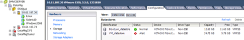

= Verifica multipath per host ESXi
:allow-uri-read: 
:icons: font
:imagesdir: ../media/

[role="lead"]
Nell'ambito del processo Foreign LUN Import (FLI), verificare che il multipath sia configurato e funzioni correttamente sugli host.

Completare la seguente procedura per gli host ESXi.

.Fasi
. Determinare ESXi e la macchina virtuale utilizzando VMware vSphere Client.
+

. Determinare le LUN SAN da migrare utilizzando il client vSphere.
+
image::../media/esxi_host_2.png[Dispositivi storage vSphere]

. Determinare i volumi VMFS e RDM (vfat) da migrare: `esxcli storage filesystem list`
+
[listing]
----
Mount Point                                        Volume Name        UUID                                 Mounted  Type           Size         Free
-------------------------------------------------  -----------------  -----------------------------------  -------  ------  -----------  -----------
/vmfs/volumes/538400f6-3486df59-52e5-00262d04d700  BootLun_datastore  538400f6-3486df59-52e5-00262d04d700     true  VMFS-5  13421772800  12486443008
/vmfs/volumes/53843dea-5449e4f7-88e0-00262d04d700  VM_datastore       53843dea-5449e4f7-88e0-00262d04d700     true  VMFS-5  42681237504   6208618496
/vmfs/volumes/538400f6-781de9f7-c321-00262d04d700                     538400f6-781de9f7-c321-00262d04d700     true  vfat     4293591040   4269670400
/vmfs/volumes/c49aad7f-afbab687-b54e-065116d72e55                     c49aad7f-afbab687-b54e-065116d72e55     true  vfat      261853184     77844480
/vmfs/volumes/270b9371-8fbedc2b-1f3b-47293e2ce0da                     270b9371-8fbedc2b-1f3b-47293e2ce0da     true  vfat      261853184    261844992
/vmfs/volumes/538400ef-647023fa-edef-00262d04d700                     538400ef-647023fa-edef-00262d04d700     true  vfat      299712512     99147776
~ #
----
+
[NOTE]
====
In caso di VMFS con estensione, è necessario migrare tutte le LUN che fanno parte dell'intervallo. Per visualizzare tutte le estendimenti nella GUI, accedere a Configuration > hardware > Storage e fare clic su datastore per selezionare il collegamento Properties (Proprietà).

====
+
[NOTE]
====
Dopo la migrazione, mentre vengono aggiunte nuovamente allo storage, vengono visualizzate più voci LUN con la stessa etichetta VMFS. In questo scenario, chiedere al cliente di selezionare solo la voce contrassegnata come Head.

====
. Determinare il LUN e le dimensioni da migrare: `esxcfg-scsidevs -c`
+
[listing]
----
Device UID                            Device Type      Console Device                                            Size      Multipath PluginDisplay Name
mpx.vmhba36:C0:T0:L0                  CD-ROM           /vmfs/devices/cdrom/mpx.vmhba36:C0:T0:L0                  0MB       NMP     Local Optiarc CD-ROM (mpx.vmhba36:C0:T0:L0)
naa.60060e801046b96004f2bf4600000014  Direct-Access    /vmfs/devices/disks/naa.60060e801046b96004f2bf4600000014  20480MB   NMP     HITACHI Fibre Channel Disk (naa.60060e801046b96004f2bf4600000014)
naa.60060e801046b96004f2bf4600000015  Direct-Access    /vmfs/devices/disks/naa.60060e801046b96004f2bf4600000015  40960MB   NMP     HITACHI Fibre Channel Disk (naa.60060e801046b96004f2bf4600000015)
~~~~~~ Output truncated ~~~~~~~
~ #
----
. Identificare i LUN RDM (Raw Device Mapping) da migrare.
. Trova dispositivi RDM: `+find /vmfs/volumes -name **-rdm**+`
+
[listing]
----
/vmfs/volumes/53843dea-5449e4f7-88e0-00262d04d700/Windows2003/Windows2003_1-rdmp.vmdk
/vmfs/volumes/53843dea-5449e4f7-88e0-00262d04d700/Windows2003/Windows2003_2-rdm.vmdk
/vmfs/volumes/53843dea-5449e4f7-88e0-00262d04d700/Linux/Linux_1-rdm.vmdk
/vmfs/volumes/53843dea-5449e4f7-88e0-00262d04d700/Solaris10/Solaris10_1-rdmp.vmdk
----
. Rimuovere -rdmp e -rdm dall'output precedente ed eseguire il comando vmkfstools per trovare il mapping vml e il tipo RDM.
+
[listing]
----
# vmkfstools -q /vmfs/volumes/53843dea-5449e4f7-88e0-00262d04d700/Windows2003/Windows2003_1.vmdk
vmkfstools -q /vmfs/volumes/53843dea-5449e4f7-88e0-00262d04d700/Windows2003/Windows2003_1.vmdk
Disk /vmfs/volumes/53843dea-5449e4f7-88e0-00262d04d700/Windows2003/Windows2003_1.vmdk is a Passthrough Raw Device Mapping
Maps to: vml.020002000060060e801046b96004f2bf4600000016444636303046
~ # vmkfstools -q /vmfs/volumes/53843dea-5449e4f7-88e0-00262d04d700/Windows2003/Windows2003_2.vmdk
Disk /vmfs/volumes/53843dea-5449e4f7-88e0-00262d04d700/Windows2003/Windows2003_2.vmdk is a Non-passthrough Raw Device Mapping
Maps to: vml.020003000060060e801046b96004f2bf4600000017444636303046
~ # vmkfstools -q /vmfs/volumes/53843dea-5449e4f7-88e0-00262d04d700/Linux/Linux_1.vmdk
Disk /vmfs/volumes/53843dea-5449e4f7-88e0-00262d04d700/Linux/Linux_1.vmdk is a Non-passthrough Raw Device Mapping
Maps to: vml.020005000060060e801046b96004f2bf4600000019444636303046
~ # vmkfstools -q /vmfs/volumes/53843dea-5449e4f7-88e0-00262d04d700/Solaris10/Solaris10_1.vmdk
Disk /vmfs/volumes/53843dea-5449e4f7-88e0-00262d04d700/Solaris10/Solaris10_1.vmdk is a Passthrough Raw Device Mapping
Maps to: vml.020004000060060e801046b96004f2bf4600000018444636303046
~ #
----
+
[NOTE]
====
Passthrough è un RDM con /RDMP fisico e il nonpass-through è un RDM con /RDMV virtuale. Le macchine virtuali con RDM virtuali e copie Snapshot delle macchine virtuali si rompono dopo la migrazione a causa del delta vmdk di snapshot delle macchine virtuali che punta a un RDM con un naa ID obsoleta. Quindi, prima della migrazione, chiedere al cliente di rimuovere tutte le copie Snapshot in tali macchine virtuali. Fare clic con il pulsante destro del mouse su VM e fare clic sul pulsante Snapshot --> Snapshot Manager Delete All (Elimina tutto). Fare riferimento alla Knowledge base 3013935 di NetApp per i dettagli sul blocco con accelerazione hardware per VMware su storage NetApp.

====
. Identificare la mappatura del LUN naa al dispositivo RDM.
+
[listing]
----
~ # esxcfg-scsidevs -u | grep vml.020002000060060e801046b96004f2bf4600000016444636303046
naa.60060e801046b96004f2bf4600000016                            vml.020002000060060e801046b96004f2bf4600000016444636303046
~ # esxcfg-scsidevs -u | grep vml.020003000060060e801046b96004f2bf4600000017444636303046
naa.60060e801046b96004f2bf4600000017                            vml.020003000060060e801046b96004f2bf4600000017444636303046
~ # esxcfg-scsidevs -u | grep vml.020005000060060e801046b96004f2bf4600000019444636303046
naa.60060e801046b96004f2bf4600000019                            vml.020005000060060e801046b96004f2bf4600000019444636303046
~ # esxcfg-scsidevs -u | grep vml.020004000060060e801046b96004f2bf4600000018444636303046
naa.60060e801046b96004f2bf4600000018                            vml.020004000060060e801046b96004f2bf4600000018444636303046
~ #
----
. Determinare la configurazione della macchina virtuale: `esxcli storage filesystem list | grep VMFS`
+
[listing]
----
/vmfs/volumes/538400f6-3486df59-52e5-00262d04d700  BootLun_datastore  538400f6-3486df59-52e5-00262d04d700     true  VMFS-5  13421772800  12486443008
/vmfs/volumes/53843dea-5449e4f7-88e0-00262d04d700  VM_datastore       53843dea-5449e4f7-88e0-00262d04d700     true  VMFS-5  42681237504   6208618496
~ #
----
. Registrare l'UUID del datastore.
. Eseguire una copia di `/etc/vmware/hostd/vmInventory.xml` e prendere nota del contenuto del file e del percorso di configurazione vmx.
+
[listing]
----
~ # cp /etc/vmware/hostd/vmInventory.xml /etc/vmware/hostd/vmInventory.xml.bef_mig
~ # cat /etc/vmware/hostd/vmInventory.xml
<ConfigRoot>
  <ConfigEntry id="0001">
    <objID>2</objID>
    <vmxCfgPath>/vmfs/volumes/53843dea-5449e4f7-88e0-00262d04d700/Windows2003/Windows2003.vmx</vmxCfgPath>
  </ConfigEntry>
  <ConfigEntry id="0004">
    <objID>5</objID>
    <vmxCfgPath>/vmfs/volumes/53843dea-5449e4f7-88e0-00262d04d700/Linux/Linux.vmx</vmxCfgPath>
  </ConfigEntry>
  <ConfigEntry id="0005">
    <objID>6</objID>
    <vmxCfgPath>/vmfs/volumes/53843dea-5449e4f7-88e0-00262d04d700/Solaris10/Solaris10.vmx</vmxCfgPath>
  </ConfigEntry>
</ConfigRoot>
----
. Identificare i dischi rigidi della macchina virtuale.
+
Queste informazioni sono necessarie dopo la migrazione per aggiungere i dispositivi RDM rimossi in ordine.

+
[listing]
----
~ # grep fileName /vmfs/volumes/53843dea-5449e4f7-88e0-00262d04d700/Windows2003/Windows2003.vmx
scsi0:0.fileName = "Windows2003.vmdk"
scsi0:1.fileName = "Windows2003_1.vmdk"
scsi0:2.fileName = "Windows2003_2.vmdk"
~ # grep fileName /vmfs/volumes/53843dea-5449e4f7-88e0-00262d04d700/Linux/Linux.vmx
scsi0:0.fileName = "Linux.vmdk"
scsi0:1.fileName = "Linux_1.vmdk"
~ # grep fileName /vmfs/volumes/53843dea-5449e4f7-88e0-00262d04d700/Solaris10/Solaris10.vmx
scsi0:0.fileName = "Solaris10.vmdk"
scsi0:1.fileName = "Solaris10_1.vmdk"
~ #
----
. Determinare il dispositivo RDM, la mappatura delle macchine virtuali e la modalità di compatibilità.
. Utilizzando le informazioni precedenti, prendere nota della mappatura RDM al dispositivo, alla macchina virtuale, alla modalità di compatibilità e all'ordine.
+
Queste informazioni saranno necessarie in seguito, quando si aggiungono dispositivi RDM alla macchina virtuale.

+
[listing]
----
Virtual Machine -> Hardware -> NAA -> Compatibility mode
Windows2003 VM -> scsi0:1.fileName = "Windows2003_1.vmdk" -> naa.60060e801046b96004f2bf4600000016
-> RDM Physical
Windows2003 VM -> scsi0:2.fileName = "Windows2003_2.vmdk" -> naa.60060e801046b96004f2bf4600000017
-> RDM Virtual
Linux VM -> scsi0:1.fileName = “Linux_1.vmdk” -> naa.60060e801046b96004f2bf4600000019 -> RDM Virtual
Solaris10 VM -> scsi0:1.fileName = “Solaris10_1.vmdk” -> naa.60060e801046b96004f2bf4600000018 -> RDM Physical
----
. Determinare la configurazione multipath.
. Ottenere le impostazioni multipath per lo storage nel client vSphere:
+
.. Selezionare un host ESX o ESXi in vSphere Client e fare clic sulla scheda Configuration (Configurazione).
.. Fare clic su *Storage*.
.. Selezionare un datastore o un LUN mappato.
.. Fare clic su *Proprietà*.
.. Nella finestra di dialogo Proprietà, selezionare l'estensione desiderata, se necessario.
.. Fare clic su *dispositivo estensione* > *Gestisci percorsi* e ottenere i percorsi nella finestra di dialogo Gestisci percorso.
+
image::../media/esxi_host_3.png[Percorsi dei dispositivi di storage vSphere]

. Ottenere informazioni sul multipathing LUN dalla riga di comando dell'host ESXi:
+
.. Accedere alla console host di ESXi.
.. Eseguire esxcli storage nmp device list per ottenere informazioni multipath.
+
[listing]
----
# esxcli storage nmp device list
naa.60060e801046b96004f2bf4600000014
   Device Display Name: HITACHI Fibre Channel Disk (naa.60060e801046b96004f2bf4600000014)
   Storage Array Type: VMW_SATP_DEFAULT_AA
   Storage Array Type Device Config: SATP VMW_SATP_DEFAULT_AA does not support device configuration.
   Path Selection Policy: VMW_PSP_RR
   Path Selection Policy Device Config: {policy=rr,iops=1000,bytes=10485760,useANO=0; lastPathIndex=3: NumIOsPending=0,numBytesPending=0}
   Path Selection Policy Device Custom Config:
   Working Paths: vmhba2:C0:T1:L0, vmhba2:C0:T0:L0, vmhba1:C0:T1:L0, vmhba1:C0:T0:L0
   Is Local SAS Device: false
   Is Boot USB Device: false

naa.60060e801046b96004f2bf4600000015
   Device Display Name: HITACHI Fibre Channel Disk (naa.60060e801046b96004f2bf4600000015)
   Storage Array Type: VMW_SATP_DEFAULT_AA
   Storage Array Type Device Config: SATP VMW_SATP_DEFAULT_AA does not support device configuration.
   Path Selection Policy: VMW_PSP_RR
   Path Selection Policy Device Config: {policy=rr,iops=1000,bytes=10485760,useANO=0; lastPathIndex=0: NumIOsPending=0,numBytesPending=0}
   Path Selection Policy Device Custom Config:
   Working Paths: vmhba2:C0:T1:L1, vmhba2:C0:T0:L1, vmhba1:C0:T1:L1, vmhba1:C0:T0:L1
   Is Local SAS Device: false
   Is Boot USB Device: false

naa.60060e801046b96004f2bf4600000016
   Device Display Name: HITACHI Fibre Channel Disk (naa.60060e801046b96004f2bf4600000016)
   Storage Array Type: VMW_SATP_DEFAULT_AA
   Storage Array Type Device Config: SATP VMW_SATP_DEFAULT_AA does not support device configuration.
   Path Selection Policy: VMW_PSP_RR
   Path Selection Policy Device Config: {policy=rr,iops=1000,bytes=10485760,useANO=0; lastPathIndex=1: NumIOsPending=0,numBytesPending=0}
   Path Selection Policy Device Custom Config:
   Working Paths: vmhba2:C0:T1:L2, vmhba2:C0:T0:L2, vmhba1:C0:T1:L2, vmhba1:C0:T0:L2
   Is Local SAS Device: false
   Is Boot USB Device: false

naa.60060e801046b96004f2bf4600000017
   Device Display Name: HITACHI Fibre Channel Disk (naa.60060e801046b96004f2bf4600000017)
   Storage Array Type: VMW_SATP_DEFAULT_AA
   Storage Array Type Device Config: SATP VMW_SATP_DEFAULT_AA does not support device configuration.
   Path Selection Policy: VMW_PSP_RR
   Path Selection Policy Device Config: {policy=rr,iops=1000,bytes=10485760,useANO=0; lastPathIndex=1: NumIOsPending=0,numBytesPending=0}
   Path Selection Policy Device Custom Config:
   Working Paths: vmhba2:C0:T1:L3, vmhba2:C0:T0:L3, vmhba1:C0:T1:L3, vmhba1:C0:T0:L3
   Is Local SAS Device: false
   Is Boot USB Device: false

naa.60060e801046b96004f2bf4600000018
   Device Display Name: HITACHI Fibre Channel Disk (naa.60060e801046b96004f2bf4600000018)
   Storage Array Type: VMW_SATP_DEFAULT_AA
   Storage Array Type Device Config: SATP VMW_SATP_DEFAULT_AA does not support device configuration.
   Path Selection Policy: VMW_PSP_RR
   Path Selection Policy Device Config: {policy=rr,iops=1000,bytes=10485760,useANO=0; lastPathIndex=1: NumIOsPending=0,numBytesPending=0}
   Path Selection Policy Device Custom Config:
   Working Paths: vmhba2:C0:T1:L4, vmhba2:C0:T0:L4, vmhba1:C0:T1:L4, vmhba1:C0:T0:L4
   Is Local SAS Device: false
   Is Boot USB Device: false

naa.60060e801046b96004f2bf4600000019
   Device Display Name: HITACHI Fibre Channel Disk (naa.60060e801046b96004f2bf4600000019)
   Storage Array Type: VMW_SATP_DEFAULT_AA
   Storage Array Type Device Config: SATP VMW_SATP_DEFAULT_AA does not support device configuration.
   Path Selection Policy: VMW_PSP_RR
   Path Selection Policy Device Config: {policy=rr,iops=1000,bytes=10485760,useANO=0; lastPathIndex=1: NumIOsPending=0,numBytesPending=0}
   Path Selection Policy Device Custom Config:
   Working Paths: vmhba2:C0:T1:L5, vmhba2:C0:T0:L5, vmhba1:C0:T1:L5, vmhba1:C0:T0:L5
   Is Local SAS Device: false
   Is Boot USB Device: false
----

