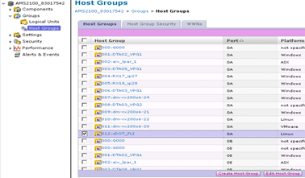

= Rimozione dei LUN di origine dallo storage ONTAP
:allow-uri-read: 
:icons: font
:imagesdir: ../media/

[role="lead"]
I seguenti passaggi descrivono come rimuovere i LUN di origine dallo storage ONTAP al termine della migrazione.

NOTE: Questa attività utilizza un array _HDS AMS2100_ negli esempi. Le attività potrebbero essere diverse se si utilizza un array diverso o una versione diversa della GUI dell'array.

.Fasi
. Accedere a Hitachi Storage Navigator Modular.
. Selezionare il gruppo di host ONTAP creato durante la fase del piano e selezionare *Modifica gruppo di host*.
+

. Selezionare *Ports* (Porte) e *Forced Set* (Imposta forzato) su tutte le porte selezionate.
+
image::../media/remove_source_luns_from_ontap_storage_2.png[Modificare i gruppi di host]

. Selezionare i LUN host migrati da LUN logici assegnati. Utilizzare i nomi LUN per ciascun host menzionato nel foglio di lavoro LUN di origine. Selezionare LUN degli host Windows 2012, RHEL 5.10 e ESXi 5.5 e selezionare *Rimuovi*.
+
image::../media/remove_source_luns_from_ontap_storage_3.png[rimuovere i lun di origine dallo storage ONTAP 3]

